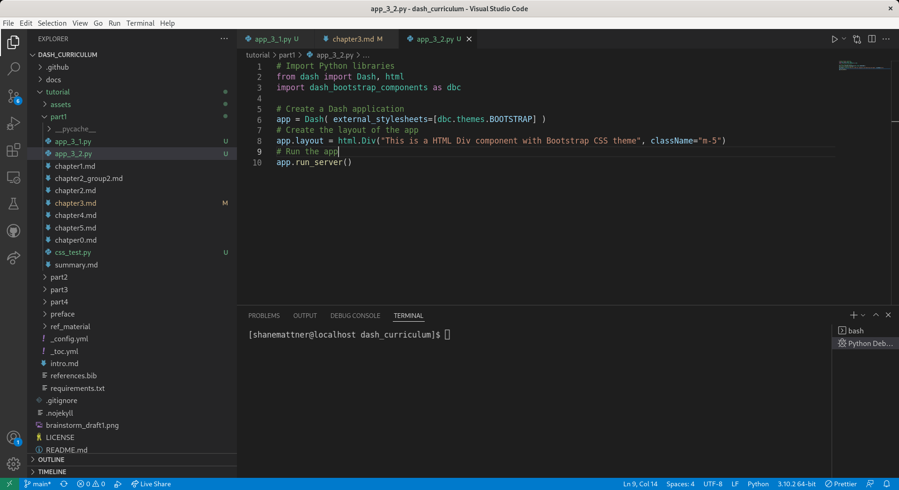
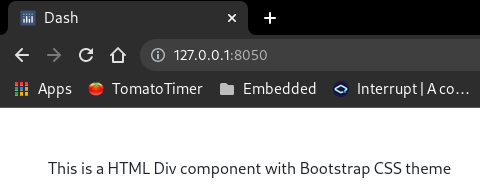
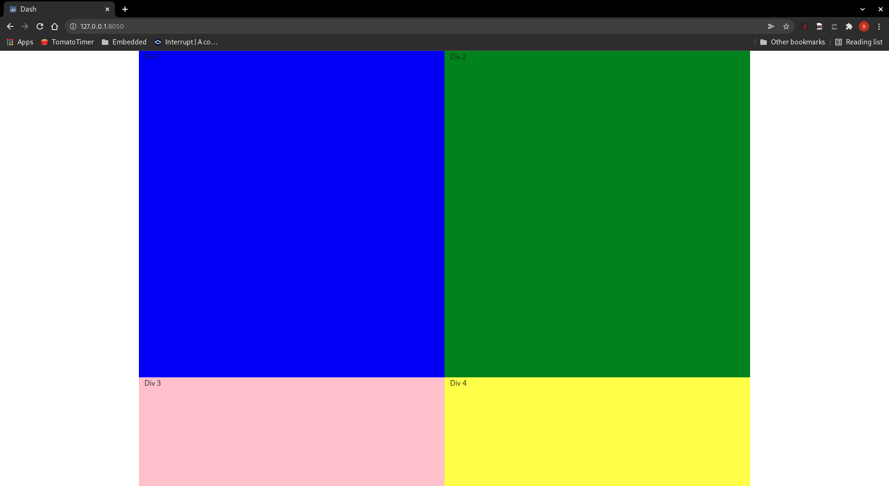

# Chapter 3 - Dash Components and Layouts
## Overview

In this chapter we explore Dash **layouts** and the **components** that make up the layout.

## Dash Layout
Dash applications are comprised of 2 parts:
- Layout: What the application looks like
- Callabacks: Interactivity of the application

***
The **layout** is made up of **components**.  Let's make a minimal Dash application to demonstrate this concept:
<details>
  <summary>Minimal Dash App</summary>
  
Create **app_3_1.py** in the `tutorial/part1` directory:


Copy/paste the minimal Dash app code:  
```python
# Import Python libraries
from dash import Dash, html 

# Create a Dash application
app = Dash()
# Create the layout of the app
app.layout = html.Div("This is a HTML Div component")
# Run the app
app.run_server()
```

Now **Run/Debug** the code:


Open a web browser, enter http://127.0.0.1:8050/ in the address bar, and you should see our minimal application:

</details>

***

Next, we'll add some styling with **CSS**.   We'll use a [stylesheet](https://www.w3schools.com/css/css_intro.asp) from the **Bootstrap** library.  
<details>
  <summary>CSS</summary>

Create **app_3_2.py** in the `tutorial/part1` directory:



Copy/paste the minimal Dash + CSS app code:  
```python
# Import Python libraries
from dash import Dash, html 
import dash_bootstrap_components as dbc

# Create a Dash application, pass in a stylesheet from Bootstrap
app = Dash( external_stylesheets=[dbc.themes.BOOTSTRAP] )
# Create the layout of the app
app.layout = html.Div("This is a HTML Div component with Bootstrap CSS theme", className="m-5")
# Run the app
app.run_server()
```

Run the code, open a web browser, enter http://127.0.0.1:8050/ in the address bar, and you should see our minimal application with a slightly different style this time:


vs


</details>

***

Let's continue to learn about **Bootstrap**, [the most popular CSS Framework for developing responsive and mobile-first websites](https://www.w3schools.com/whatis/whatis_bootstrap.asp).  We will be using the Dash Bootstrap Components library that makes it [easier to build consistently styled apps with complex, responsive layouts](https://dash-bootstrap-components.opensource.faculty.ai/)

<details>
  
  <summary>Dash Bootstrap Components</summary>
  
***
  
<details>

  <summary>Layout in Bootstrap</summary>
  
* [Layout in Bootstrap](https://dash-bootstrap-components.opensource.faculty.ai/docs/components/layout/) is controlled using the grid system. The Bootstrap grid has twelve columns

* 3 main layout components: Container, Row, and Column.
  * Container wraps the entire app
  * Rows only contain columns
  * Columns holds your components

Now let's add to our minimal, CSS styled app by using a Container, Rows, and Columns.  Create a new file called **app_3_3.py** and copy/paste the following code:
```python
# Import Python libraries
from dash import Dash, html 
import dash_bootstrap_components as dbc

# Create a Dash application, pass in a stylesheet from Bootstrap
app = Dash( external_stylesheets=[dbc.themes.BOOTSTRAP] )

# Create the layout of the app
app.layout = dbc.Container([
                dbc.Row([
                    dbc.Col([
                        html.Div("Div 1", style={"outline": "2px dashed blue"})
                    ]),
                    dbc.Col([
                        html.Div("Div 2", style={"outline": "2px dashed red"})
                        ]),
                    ]),
            ],
            fluid=True # fill the horizontal space
            )

# Run the app
app.run_server()
```
You can see that we have a Container that holds our app.  Then we have 1 row that holds 2 columns. Each column has a single html.Div component that we added some CSS styling so it's easy to differentiate.


  
  </details>
  
***

