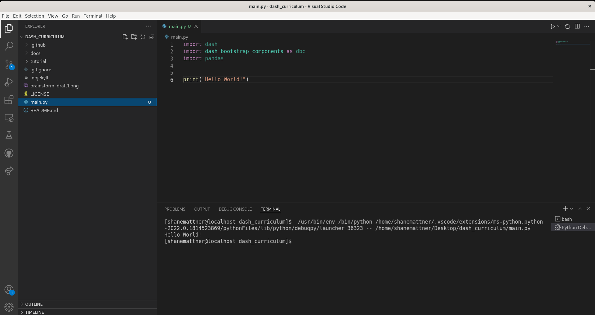
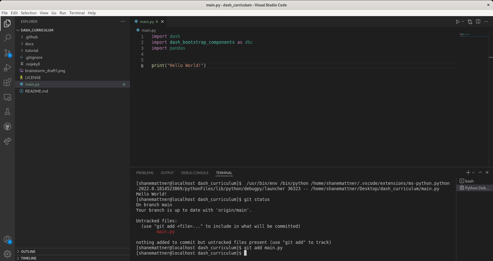

# Chapter 0 - Stack Installation
## Overview

In this chapter we will set up the tech stack used in this course.  A **tech stack** is a combination of tools used to build and run an application.  For this course we have chosen the most popular professional tools to develop our applicatoins.

- Visual Studio Code
  - Code editor and debugger
  - Extensions help us to code and improve productivity
- Python
  - Programming language we will use
  - Python libraries (such as Dash and Pandas) are collections of code that we will use to make the applications
- Git
  - Version control systems allow us to track and manage changes to our code


## Installation Instructions
<details>
  <summary>Windows</summary>
  
#### VS Code
- [Text based instructions](https://code.visualstudio.com/docs/setup/windows)
- [Video instructions](https://www.youtube.com/watch?v=MlIzFUI1QGA)
- [Extensions - Text](https://code.visualstudio.com/docs/languages/python)
- [Extensions - Video](https://www.youtube.com/watch?v=Z3i04RoI9Fk)
#### Python
- [Text based instruction](https://www.python.org/downloads/)
- [Video instructions](https://www.youtube.com/watch?v=Kn1HF3oD19c)
- Copy and paste this line into a terminal to install the required Python libraries:\
``` pip install dash dash-bootstrap-components pandas```
#### Git
- [Git - Installation](https://git-scm.com/book/en/v2/Getting-Started-Installing-Git)
</details>

<details>
  <summary>Mac</summary>
  
#### VS Code
- [Text based instructions](https://code.visualstudio.com/docs/setup/mac)
- [Video instructions](https://www.youtube.com/watch?v=bJaBHGKHv9A)
- [Extensions - Text](https://code.visualstudio.com/docs/languages/python)
- [Extensions - Video](https://www.youtube.com/watch?v=Z3i04RoI9Fk)
#### Python
- [Text based instruction](https://www.python.org/downloads/)
- [Video instructions](https://www.youtube.com/watch?v=M323OL6K5vs)
- Copy and paste this line into a terminal to install the required Python libraries:\
``` pip install dash dash-bootstrap-components pandas```
#### Git
- [Git - Installation](https://git-scm.com/book/en/v2/Getting-Started-Installing-Git)
</details>

<details>
  <summary>Linux</summary>
  
#### VS Code
- [Text based instructions](https://code.visualstudio.com/docs/setup/linux)
- [Video instructions](https://www.youtube.com/watch?v=Y1fei1mzP7Q)
- [Extensions - Text](https://code.visualstudio.com/docs/languages/python)
- [Extensions - Video](https://www.youtube.com/watch?v=Z3i04RoI9Fk)
#### Python
- [Text based instruction](https://www.python.org/downloads/)
- [Video instructions](https://www.youtube.com/watch?v=Br2xt6B57SA)
- Copy and paste this line into a terminal to install the required Python libraries:\
``` pip install dash dash-bootstrap-components pandas```
#### Git
- [Git - Installation](https://git-scm.com/book/en/v2/Getting-Started-Installing-Git)
</details>


## Test the stack
Let's make sure everything is installed correctly.  Open VScode and create a new file called **main.py**.  Copy and paste this code:
```
import dash 
import dash_bootstrap_components as dbc
import pandas


print("Hello World!")
```
Then press **F5** to debug/run the file.  If we see **Hello World!** printed out in the console then we know the Python code is working properly with all libraries installed. 


Now that we have our **main.py** file running let's use ```git``` to track the file in our repository.  Go to the terminal in VScode and type ```git status```.  We see that there is a new **Untracked file** called **main.py**:


We'll **add** that file to the git **staging area** with ```git add main.py```:


Then we need to **commit** the changes.  Type in ```git commit -m "This is a commit message"```.  Every commit needs a message and this is a good opportunity to include a short reminder of what this commit changed:


## Notes
- **Git** is not related to **Github**.  Github is a website that stores [repositories](https://www.youtube.com/watch?v=9A26ybw6tGY), and Git is a version control system.
